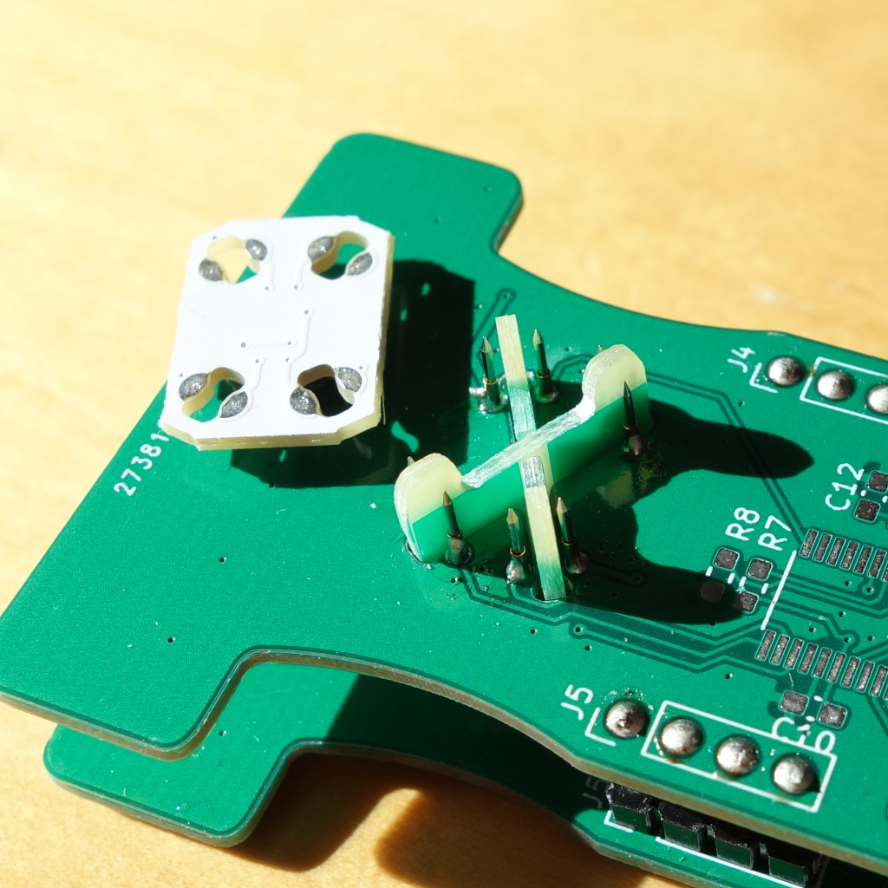

# LED Driver for 3D sculptures based on an ESP32 with PSRAM + an STM32F0XX


# Design:

```
   programming &
  micropython REPL
         ||
     .--------.
     |  usb   |
     |   to   |
     | serial | 
     '--------'
         ||
   .--------------.                               _____________.--
   |  ESP32-D0WD  |          (UART)              |             |-- multiple LED strands
   |   8M PSRAM   |-- 16bit/color LED frames --> |  STM32F0XX  |-- (temporal dithered)
   |  16M FLASH   |                              |_____________|--
   '--------------'                                            '--

```

  

# ESP Code `firmware/esp32/`

- Running micropython

- 60 FPS 16bit/color (48bit) animation with some routines written in C for speed.

- Animations use 3D-coordinates of the LEDs, as well as the direction they're pointing at

- Gamma correction & support for multiple LED orderings.

- Cached animation frames to prevent garbage collection hiccups

- Web interface (HTTPS capable, but no automatic cert. updates)

# STM32 Code `firmware/stm32/`

## Protocol

Sending a frame: `( [16 bit brightness]* [ FF FF FF F0 ] )*`

Brightness must be little endian integers in the (inclusive) range `[0 .. 0xFF00]`

`[ FF FF FF F0 ]` is an end of frame marker and allows the protocol to synchronize
in the event of an uneven number of bytes being written to the serial port

The firmware is completely agnostic about the color ordering.

Some of the following firmwares allow for tuning of the pulse interval:

`( [16 bit number]* [ FF FF FF F3 ] )*`

The given number is the number of cycles outputting a byte should take.
(Useful for increasing the FPS and thus improving temporal dithering.

## `dither16.bin`

Read in 16bit/color data in, drive 8 ws2812 LED strips in parallel

## `strip4.bin`

Read in 16bit/color data in, drive 4 ws2812 LED strips in parallel

## `strip5.bin`

Read in 16bit/color data in, drive 5 ws2812 LED strips in parallel,
Supports tuning the pulse interval.

## `relayball.bin`

Read in 16bit/color data in, drive 4 circuit-routed ws2812 LED meshes.
Small LED strands are connected through PADAUK based relay-chips
(`firmware/pdk/relay/`) that use in-band messages to build up routing
circuits.

## `uartball16.bin`

Drives up-to 8 busses with PADAUK based LED drivers which read 38400 baud
uart. `firmware/pdk/softpwm/`

##  `dither8.bin`

Older code using a different input protocol, reads 8bit/color data & transforms this to 16 bit colors
after gamma correction

# STM32 Tester code

## `jitter_timer.bin`

Tester for PADAUK ws2812 relay chips. `firmware/pdk/relay/`




Tests for functionality and measures the clock speed deviation (for binning).

## `timing_experiment.bin`

Dynamically adjust the `T1H` and `T1L` intervals from the ws2812 protocol to
test its limits.


